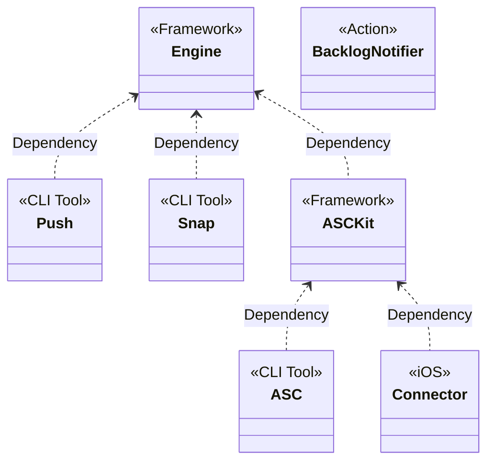

I am the maintainer of the following open source software:

## Information
- [WWDC](https://github.com/Blackjacx/WWDC) Bullet-point summaries for the most popular WWDC session videos
- [Development](https://github.com/Blackjacx/Development) Coding/review guidelines, interview questions, links and FAQ around (mobile) dev

## Apps
- [Emojis](https://github.com/Blackjacx/Emojis) My SwiftUI playground

## App Store Connect
- [Engine](https://github.com/Blackjacx/Engine) • SPM package powering all my other open source software
- [ASCKit](https://github.com/Blackjacx/Assist) • SPM package implementing the App Store Connect API
- [ASC](https://github.com/Blackjacx/Assist) ([Homebrew Formula](https://github.com/Blackjacx/homebrew-formulae)) • Swift command-line tool `asc` for accessing App Store Connect API (powered by ASCKit)
- [Connector](https://github.com/Blackjacx/Connector)

## Development Tools
- [Snap](https://github.com/Blackjacx/Assist) • Swift command-line tool `snap` for quickly generating screenshots from your app
- [Push](https://github.com/Blackjacx/Assist) • Swift command-line tool `push` for sending push messages via Firebase and APNS

## Packages
- [Columbus](https://github.com/Blackjacx/Columbus) • Multi-platform Country picker framework
- [Source](https://github.com/Blackjacx/Source) • A generic data source implementation
- [SHDateFormatter](https://github.com/Blackjacx/shdateformatter) • Implementation of a flexible date formatter
- [SHSearchBar](https://github.com/Blackjacx/shsearchbar) • A flexible search bar implementation

## GitHub Actions
- [Backlog Notifier](https://github.com/Blackjacx/backlog-notifier) • Automatically comments on tickets connected to your PRs, with the release version, when they get released.

## Relations

